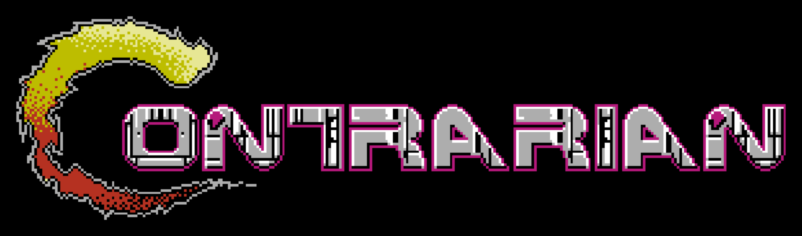
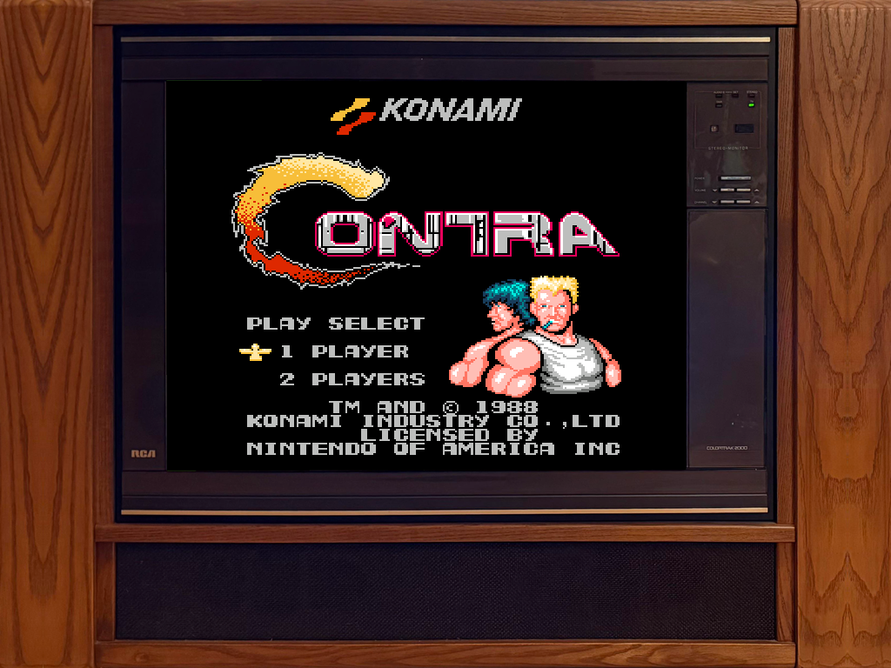

  

https://github.com/USER/REPO/assets/0000000/REPLACE-ME-contrarian.mp4

<!--
  VIDEO. Drag docs/contrarian.mp4 onto the README in GitHub's editor: it
  uploads the file and inserts the URL for you, which renders as an inline
  player. Replace the placeholder above with what it inserts. A plain relative
  path to the .mp4 does NOT embed -- markdown only links it.

  Still fallback, already in the repo:
  
-->

---

Lucky you, you get to play Contra on the greatest TV ever made: The RCA ColorTrak 2000 GMR2740T from 1986. Maybe you had a different TV growing up. Maybe you thought it was the greatest. You were wrong then, and you're wrong now.

That's it, go play Contra. You can try to play other games. They won't work. Why? Because all you've ever needed was Contra. Maybe you didn't know it until now. Again, lucky you.

You want to save your game? Tough shit. Your mom just yelled and the Hamburger Helper is ready. Pause it or start over after dinner, champ.
